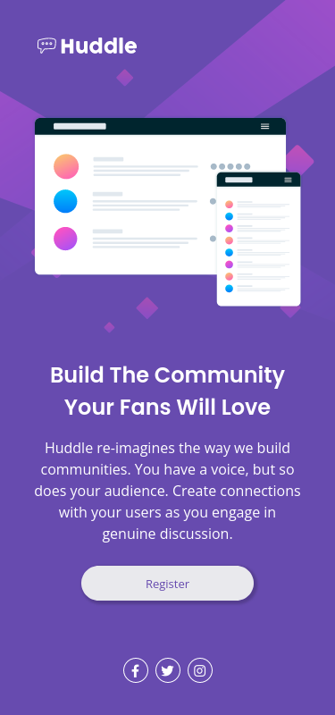

# Frontend Mentor - Huddle landing page with single introductory section solution

This is a solution to the [Huddle landing page with single introductory section challenge on Frontend Mentor](https://www.frontendmentor.io/challenges/huddle-landing-page-with-a-single-introductory-section-B_2Wvxgi0).

## Table of contents

- [Overview](#overview)
  - [The challenge](#the-challenge)
  - [Screenshot](#screenshot)
  - [Links](#links)
- [My process](#my-process)
  - [Built with](#built-with)
  - [What I learned](#what-i-learned)
  - [Continued development](#continued-development)
  - [Useful resources](#useful-resources)
- [Author](#author)

**Note: Delete this note and update the table of contents based on what sections you keep.**

## Overview

### The challenge

The goal:

- View the optimal layout for the page depending on their device's screen size
- See hover states for all interactive elements on the page

### Screenshot

### Links

- Solution URL: (https://github.com/AdrianaMagdalena/huddle-landing-page/)
- Live Site URL: (https://adrianamagdalena.github.io/huddle-landing-page/)

## My process

### Built with

- Semantic HTML5 markup
- CSS custom properties
- Flexbox
- CSS Grid
- Mobile-first workflow

### What I learned

During this project I learned to use css custom properties.
I also dove a little deeper info semantic html elements and understood them more fully.

### Continued development

For the next project:

- Review my knowledge about semantic HTML markup
- Be more thoughtful when planning out the HTML structure
- Read more on useful cases of grid and flexbox usage - when to use which and how to decide

For future (in general):

- Learn more about accessibility
- Learn more about responsiveness

### Useful resources

- [Josh's CSS Reset](https://www.joshwcomeau.com/css/custom-css-reset/) - My go-to CSS Reset template, to make work with CSS simpler and faster
- [Facebook logo](https://fontawesome.com/icons/facebook-f?f=brands&s=solid&pc=%23000000)
- [Instagram logo & Twitter logo](https://ionic.io/ionicons/)

## Author

- Website (not yet finished as per June 9th 2023) - [Adriana Szetlak - Portfolio](https://adrianamagdalena.github.io/portfolio/)
- GitHub - [Adriana Szetlak](https://github.com/AdrianaMagdalena)
- Frontend Mentor - [@AdrianaMagdalena](https://www.frontendmentor.io/profile/AdrianaMagdalena)
